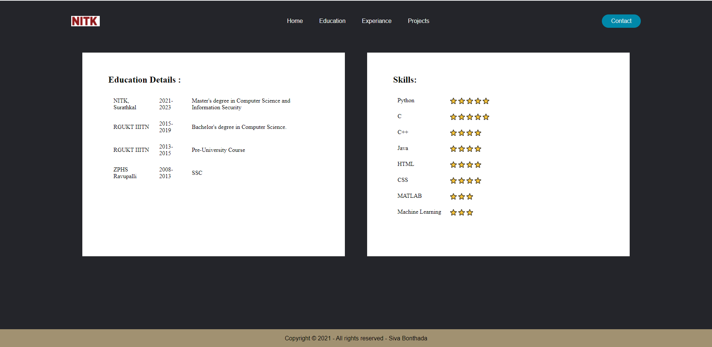

# My Portfolio

This is a personal web page 

## Technologies Used

- HTML
- CSS 

## Template Preview Images

## Color Reference

| Color             | Hex                                                                |
| ----------------- | ------------------------------------------------------------------ |
| Background Color |  #24252A |
| Link hover Color |  #0088a9 |
| Footer Color |  #cc9966 |
| Container Color |  #cc9966 |

## FAQ

#### Question 1

Answer 1

#### Question 2

Answer 2

